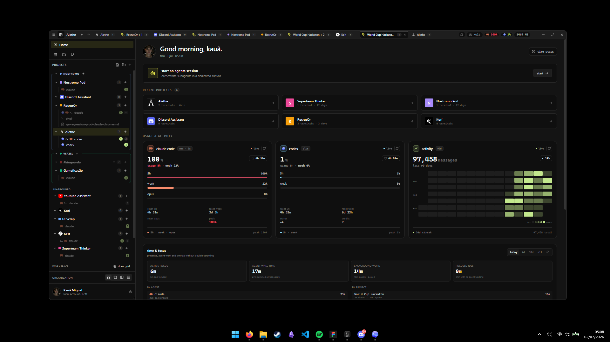
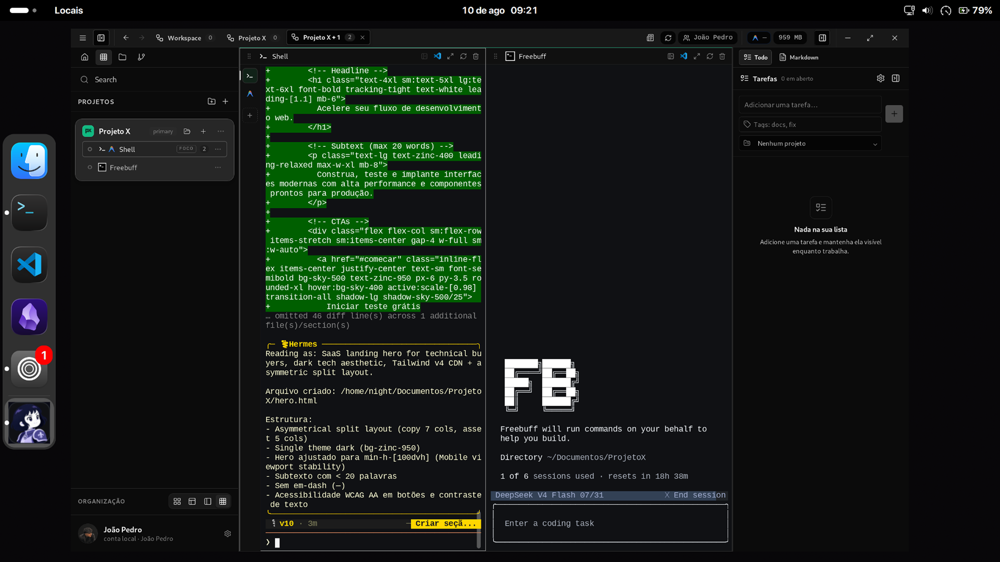

<a id="readme-top"></a>

<br />
<div align="center">
  <a href="https://github.com/Kc1t/alethe-agents">
    
  </a>

  <h1 align="center">Arco</h1>

  <p align="center">
    Reveal the state of every agent, shell, and project.
    <br />
    A cross-platform, local-first desktop workspace for coding agents and real terminals.
  </p>

  <p align="center">
    <a href="https://github.com/Kc1t/alethe-agents/actions/workflows/ci.yml"></a>
    <a href="https://github.com/Kc1t/alethe-agents/releases"></a>
    <a href="https://github.com/Kc1t/alethe-agents/blob/main/LICENSE"></a>
    <a href="https://github.com/Kc1t/alethe-agents/graphs/contributors"></a>
    <a href="https://github.com/Kc1t/alethe-agents/stargazers"></a>
    <a href="https://github.com/Kc1t/alethe-agents/issues"></a>
  </p>

  <p align="center">
    <a href="https://github.com/Kc1t/alethe-agents/releases">Download</a>
    ·
    <a href="https://github.com/Kc1t/alethe-agents/issues/new?labels=bug">Report Bug</a>
    ·
    <a href="https://github.com/Kc1t/alethe-agents/issues/new?labels=enhancement">Request Feature</a>
    ·
    <a href="#contributing">Contribute</a>
  </p>
</div>

> [!IMPORTANT]
> Arco is an early public release. The desktop app is free, open source, and local-first. Optional hosted services, such as sync or cloud backup, may be offered separately later.

<div align="center">
  
</div>

## Supported Platforms

<table>
  <tr>
    <th width="33.33%">macOS</th>
    <th width="33.33%">Windows</th>
    <th width="33.33%">Linux</th>
  </tr>
  <tr>
    <td align="center">
      
    </td>
    <td align="center">
      
    </td>
    <td align="center">
      
    </td>
  </tr>
  <tr>
    <td align="center">Available on macOS</td>
    <td align="center">Available on Windows</td>
    <td align="center">Available on Linux</td>
  </tr>
</table>

## What Arco Is

**Arco** is a cross-platform desktop workspace for running and resuming multiple coding agents and shells in parallel on Windows, macOS, and Linux. It combines projects, groups, containers, split panes, terminal sub-tabs, real PTYs, local history, session resume, and memory controls in one app.

It is built for developers who use Claude Code, Codex, OpenCode, and local terminals across multiple repositories or client contexts.

Built with Tauri, Rust, React, TypeScript, Vite, `portable-pty`, and `xterm.js`.

## Product Philosophy

Arco is intentionally not a maximalist desktop suite. Its purpose is to provide a calm,
reliable workspace for coding agents, terminals, and project context — then let each user decide
which additional capabilities belong in that workspace.

The product follows a principle similar to Obsidian: a focused core, a durable local foundation,
and optional capabilities that can be brought in when they are useful. Arco should grow with the
user's workflow rather than forcing every workflow to carry the same interface, controls, and
background services.

For that reason, new capabilities should be introduced behind explicit feature flags or opt-in
settings whenever they are not essential to the core workspace. Optional features must be possible
to discover, enable, disable, and maintain without making the default environment feel crowded or
unfinished. A clean installation should remain a first-class experience as the product evolves.

This is a deliberate response to a common failure mode in developer tools: accumulating every
possible feature until the product becomes harder to understand, harder to configure, and noisier
to operate than the problem it was meant to solve. Arco values coherence over volume, and user
choice over forced completeness.

## What It Gives You

- Keep coding agents, shells, and project context in one durable workspace.
- Close visual containers without killing the underlying terminal process.
- Resume local sessions and scrollback instead of rebuilding context from scratch.
- Organize work by project, group, pane, and terminal sub-tab.
- Suspend noisy or expensive groups when you need memory back.

## Core Concepts

- **Workspace**: the persistent desktop surface where active work lives.
- **Project**: a saved working context with terminals, layout, color, and local state.
- **Group**: a collection of projects that can be opened, collapsed, or suspended together.
- **Container**: the visible frame for an opened project.
- **Pane**: a terminal view inside a container.
- **Terminal sub-tab**: a separate shell or agent session inside the same terminal space.
- **PTY**: the real backend terminal process that keeps running even when the UI changes.

## Capabilities

- Project and group based workspace.
- Real terminal processes through a Rust PTY backend.
- Split-pane containers with automatic, spotlight, sidebar, and custom grid layouts.
- Multiple sub-tabs per terminal for agents or shells.
- Persisted local projects, layouts, scrollback, sessions, and preferences.
- Close containers without killing running processes.
- Suspend groups to free memory.
- Local backup export/import.
- `arco` terminal command to open any folder as a project.
- Spotify Now Playing through the user's own Spotify app credentials.
- Experimental agent planning canvas.
- GitHub Actions release workflow for Windows, Linux, and macOS.

## Install

Use the published installers from [Releases](https://github.com/Kc1t/alethe-agents/releases).

### Windows SmartScreen / Defender warning

> [!WARNING]
> Windows builds are **not code-signed yet**. Windows Defender may flag `arco.exe` as
> `Trojan:Win32/Bearfoos.A!ml` and quarantine or delete it. **This is a false positive.**

The `!ml` suffix means the detection came from Defender's machine-learning heuristic, not from a
malware signature. Arco trips it because it does exactly what a terminal multiplexer must do:
spawn child processes, create PTYs, write commands into them, and self-update — all from an
unsigned binary with no download reputation yet.

If Defender removes the app:

1. Open **Windows Security → Virus & threat protection → Protection history**.
2. Find the Arco entry and choose **Actions → Restore**.
3. Add an exclusion for `%LOCALAPPDATA%\Arco` (and for `src-tauri/target` if you build from
   source, otherwise your dev binaries get quarantined too).

You can also report the file at
[Microsoft Security Intelligence](https://www.microsoft.com/wdsi/filesubmission) as an incorrect
detection. Code signing for Windows is tracked on the [roadmap](#roadmap); it will remove these
warnings for good.

macOS builds are not notarized yet either, so Gatekeeper will show an unidentified-developer
warning. Right-click the app and choose **Open** to bypass it.

## Run From Source

```sh
git clone https://github.com/Kc1t/alethe-agents.git
cd alethe-agents
npm install
npm run app
```

## Requirements

- Node.js 18+
- Rust stable
- Windows 10/11, Linux, or macOS
- Visual Studio Build Tools on Windows
- Tauri system dependencies on Linux

Linux dependencies:

```sh
sudo apt update
sudo apt install -y libwebkit2gtk-4.1-dev libappindicator3-dev librsvg2-dev patchelf
```

## Commands

```sh
# run the desktop app in development mode
npm run app

# run only the frontend in the browser
npm run dev

# build the frontend
npm run build

# build the desktop app/installers
npm run tauri -- build
```

Build artifacts are written to:

```text
src-tauri/target/release/bundle/
```

## Typical Workflows

- Keep one project open with a shell, a coding agent, and a test runner in separate panes.
- Split a workspace by repository, client, feature branch, or debugging session.
- Leave long-running terminals alive while changing layouts or closing visual containers.
- Suspend inactive groups to free memory and restore them when the context is needed again.
- Export a local backup before moving machines or testing risky changes.

## Terminal Command

Install the `arco` command from **Settings ▸ Integrations ▸ Terminal command** to open a folder
as a project without leaving the terminal:

```bash
arco                # opens the current folder
arco .              # same
arco ~/some/project # opens the given folder
```

If the folder is already a project, Arco brings it into the workspace instead of duplicating it.
If it is not, the project is created with a terminal already pointing at that folder. When Arco is
already running, the existing window is focused rather than starting a second instance.

The command is installed to `~/.local/bin/arco` on macOS/Linux and to
`%LOCALAPPDATA%\Arco\bin\arco.cmd` on Windows (added to the user `Path`). Reinstall it after
moving or reinstalling the app — the settings screen flags a stale command.

## Spotify

To use Now Playing, create an app in the Spotify Developer Dashboard and register this Redirect URI:

```text
http://127.0.0.1:8888/callback
```

Then add your `Client ID` and `Client Secret` in **Preferences > Spotify**.

For local development, a `.env` file can also provide:

```env
SPOTIFY_CLIENT_ID=
SPOTIFY_CLIENT_SECRET=
```

## Releases

The release workflow builds installers for:

- Windows x64
- Linux x64
- macOS Apple Silicon
- macOS Intel

Create a release from a tag:

```sh
git tag v1.0.0
git push origin v1.0.0
```

> [!NOTE]
> macOS builds distributed outside the App Store should be signed and notarized with an Apple Developer certificate. Without that, users may see an unidentified developer warning.

## Roadmap

- [x] Workspace with projects, groups, and containers.
- [x] Real PTYs with spawn, attach, resize, and scrollback.
- [x] Automatic layouts and custom grid.
- [x] Sub-tabs per terminal.
- [x] Local desktop build.
- [x] GitHub Actions for Windows, Linux, and macOS.
- [ ] Windows release signing.
- [ ] macOS notarization.
- [ ] Linux/macOS validation on real machines.
- [ ] Visual documentation with screenshots/GIFs.
- [ ] Optional cloud sync/backup.
- [ ] Agent marketplace/library.

## Contributing

Contributions are welcome. Read [`CONTRIBUTING.md`](CONTRIBUTING.md) for setup, project layout, and house rules.

The easiest ways to help right now are:

- Pick an issue labeled [`good first issue`](https://github.com/Kc1t/alethe-agents/issues?q=is%3Aissue+is%3Aopen+label%3A%22good+first+issue%22) or [`help wanted`](https://github.com/Kc1t/alethe-agents/issues?q=is%3Aissue+is%3Aopen+label%3A%22help+wanted%22) — comment on it to claim it.
- Open a bug report with clear reproduction steps.
- Request a feature with the workflow it would improve.
- Improve docs, screenshots, setup notes, or platform validation — Linux and macOS are the least tested.
- Open a focused pull request with a short explanation and screenshots/GIFs when the UI changes.

For larger changes, open an issue first so the direction can be discussed before implementation.

## Built with Arco

Projects and products built with Arco as the workspace — agents running in parallel, shells alongside them, sessions resumed across days.

<!-- showcase:start -->

_Nothing here yet._ Built something with Arco? Add it to [`SHOWCASE.md`](SHOWCASE.md) — it's one line and a pull request, and you end up in the contributors list too.

<!-- showcase:end -->

See [`SHOWCASE.md`](SHOWCASE.md) for the full list and how to submit.

## Contributors

Thanks to everyone helping shape Arco.

<p align="center">
  <!-- contributors:start -->
  <a href="https://github.com/Kc1t"></a>
  <a href="https://github.com/MiguelSilvaPorto"></a>
  <a href="https://github.com/HayatoG"></a>
  <a href="https://github.com/slegarraga"></a>
  <a href="https://github.com/Jbnado"></a>
  <a href="https://github.com/chintanparmar011"></a>
  <a href="https://github.com/AshSgDe29071999"></a>
  <a href="https://github.com/rlevidev"></a>
  <a href="https://github.com/mapsiva"></a>
  <a href="https://github.com/moisesz10"></a>
  <a href="https://github.com/Bakurin0"></a>
  <a href="https://github.com/SrAmaral"></a>
  <a href="https://github.com/diegoliveiraa"></a>
  <a href="https://github.com/VicktorMS"></a>
  <a href="https://github.com/rad4manthys"></a>
  <a href="https://github.com/potatoiscompiled"></a>
  <a href="https://github.com/lucianoschirmer"></a>
  <a href="https://github.com/lb1192176991-lab"></a>
  <a href="https://github.com/hgshreyas"></a>
  <a href="https://github.com/fernando-c-lima"></a>
  <a href="https://github.com/eudehh"></a>
  <a href="https://github.com/tomatotomata"></a>
  <a href="https://github.com/ThiagoSales17"></a>
  <a href="https://github.com/opedrooz"></a>
  <a href="https://github.com/GabrielKLopes"></a>
  <a href="https://github.com/floze-the-genius"></a>
  <a href="https://github.com/aryansk"></a>
  <!-- contributors:end -->
</p>

## License

The source code is distributed under **AGPL-3.0-or-later**. See [`LICENSE`](LICENSE) for details.

Official hosted services, such as sync, backup, billing, or cloud features, may be proprietary and offered separately.

The **Arco** name, logo, and official branding are reserved for official builds. See [`TRADEMARK.md`](TRADEMARK.md).

## Community

- Maintainer: [Kc1t](https://github.com/Kc1t)
- Project: <https://github.com/Kc1t/alethe-agents>
- Bugs and feature requests: <https://github.com/Kc1t/alethe-agents/issues>

<p align="right">(<a href="#readme-top">Back to top</a>)</p>
